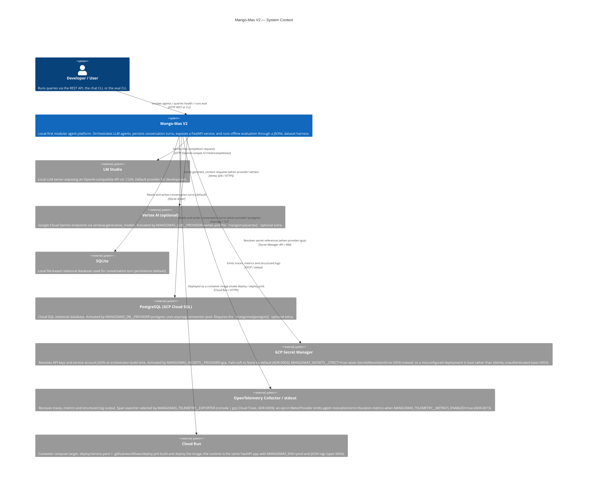

# C1 — System Context

This diagram shows Mango-Mas V2 in its broader environment: who uses it and
what external systems it depends on.

## Notes

- LM Studio is the only external **process** dependency for local development.
  Vertex AI is an external **service** consumed only when the `vertex`
  provider is selected.
- All external service coordinates are env-driven (`MANGOMAS_*` prefix); no
  endpoint, project id, or model id is hardcoded in source.
- Every GCP boundary this diagram once listed as "future" has landed, each
  through an existing registry seam rather than a rewrite: Vertex AI (ADR-001,
  v0.3.0), PostgreSQL via asyncpg and GCP Secret Manager (v0.3.1, both E2E
  verified), the Cloud Trace span exporter (ADR-0009 / spec-0001) and Cloud Run
  (spec-0004). What remains open is tracked in
  [NEXT_STEPS.md](../../NEXT_STEPS.md) — no external system on this diagram is
  aspirational.
- Multi-tenancy (ADR-0017) adds no external system. `TenancyMiddleware` reads
  an inbound header into a `ContextVar` that the storage adapters filter rows
  on, so the tenant boundary is enforced inside the existing SQLite/Postgres
  systems rather than by a new one. Default-OFF.
- Vertex AI adapter code is functional but project-level model access is
  currently blocked on the GCP side; LM Studio + GCP Secret Manager
  integration is E2E verified.
- The **evaluation harness** runs entirely in-process; it consumes the same
  `Orchestrator` / `LLMClient` stack as `/agents/{name}/invoke`. It does
  not introduce a new external dependency. See
  [docs/eval/harness.md](../eval/harness.md).
