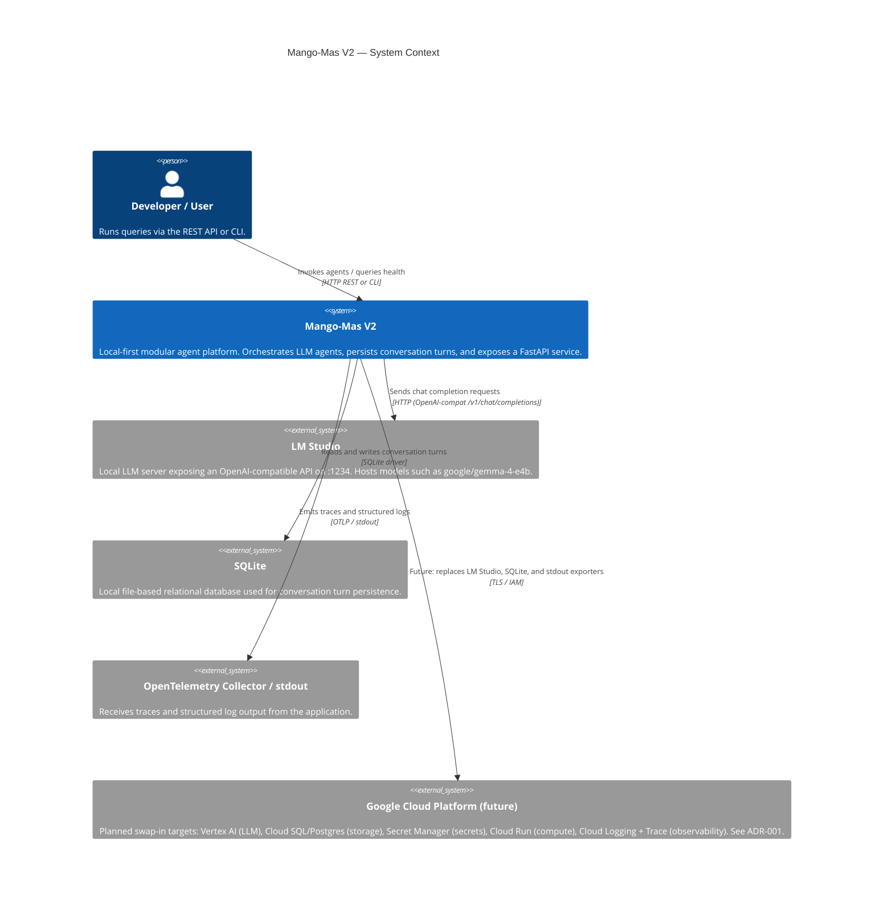

# C1 — System Context

This diagram shows Mango-Mas V2 in its broader environment: who uses it and
what external systems it depends on.

## Notes

- LM Studio is the only external process dependency for local development.
- All external service coordinates are env-driven (`MANGOMAS_*` prefix).
- GCP targets are documented in [ADR-001](../adr/0001-cloud-targets.md) and
  tracked in [NEXT_STEPS.md](../../NEXT_STEPS.md). No GCP resources are
  provisioned by this branch.
