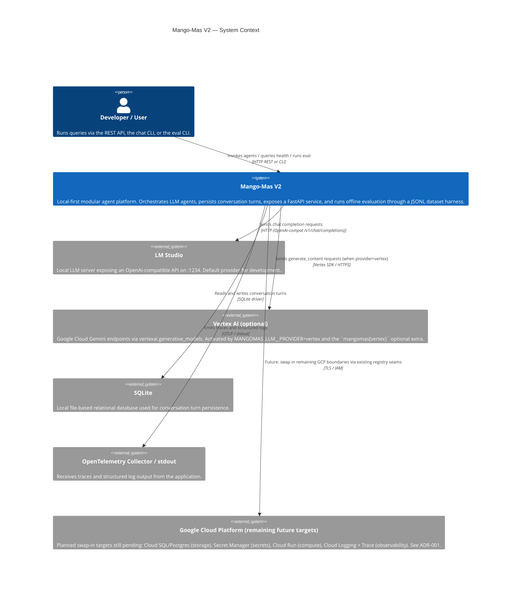

# C1 — System Context

This diagram shows Mango-Mas V2 in its broader environment: who uses it and
what external systems it depends on.

## Notes

- LM Studio is the only external **process** dependency for local development.
  Vertex AI is an external **service** consumed only when the `vertex`
  provider is selected.
- All external service coordinates are env-driven (`MANGOMAS_*` prefix); no
  endpoint, project id, or model id is hardcoded in source.
- The Vertex AI swap-in (ADR-001) shipped in v0.3.0; remaining GCP targets
  (Postgres, Secret Manager, Cloud Run, Cloud Logging/Trace) are still
  tracked in [NEXT_STEPS.md](../../NEXT_STEPS.md). No GCP resources are
  provisioned by this branch.
- The **evaluation harness** runs entirely in-process; it consumes the same
  `Orchestrator` / `LLMClient` stack as `/agents/{name}/invoke`. It does
  not introduce a new external dependency. See
  [docs/eval/harness.md](../eval/harness.md).
