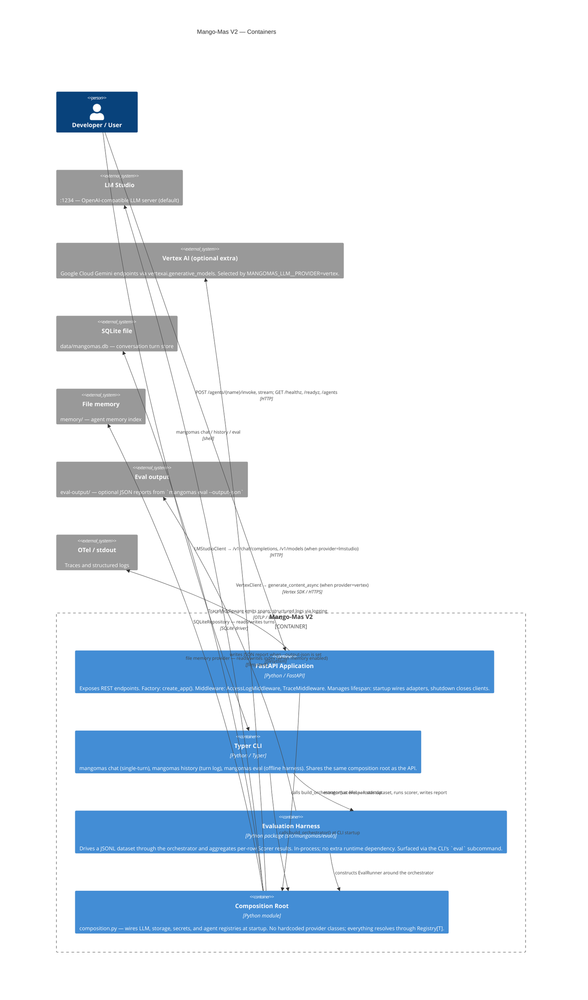

# C2 — Container Diagram

This diagram shows the major deployable / runnable units inside Mango-Mas V2
and how they communicate.

## Notes

- `api`, `cli`, and `eval_harness` share the same `composition.py` wiring;
  no duplicated adapter construction.
- The `composition` container is a module, not a separate process. It is shown
  separately to emphasise that all provider-specific code is isolated there.
- The LLM provider is chosen at runtime through `MANGOMAS_LLM__PROVIDER`.
  Today's built-in choices are `lmstudio` (the default) and `vertex` (an
  optional extra). Adding a new provider is a registry registration in
  `composition.py` — no other container changes required.
- The evaluation harness ships its own Scorer registry
  (`mangomas.eval.scorer_registry`) parallel to the agent/LLM/storage
  registries. Built-in scorers: `exact_match`, `llm_judge`, `embedding`.
- `memory/` and `eval-output/` are excluded from git and Docker (see
  `.gitignore` / `.dockerignore`).
