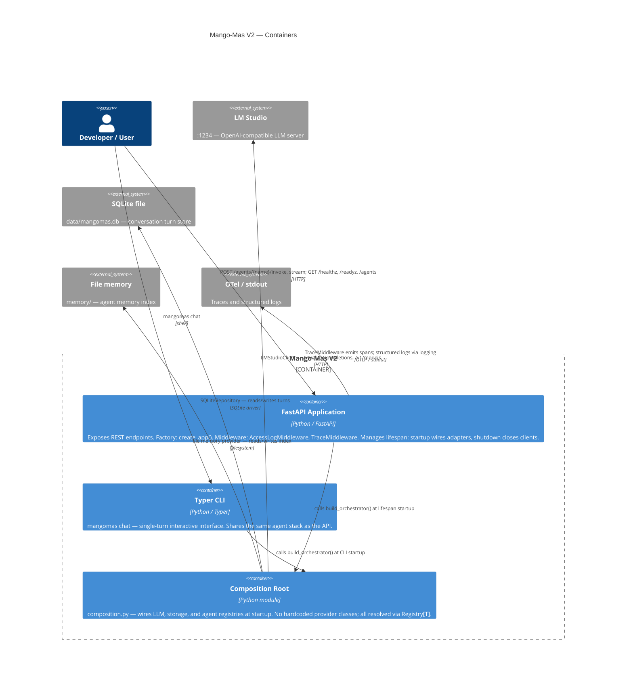

# C2 — Container Diagram

This diagram shows the major deployable / runnable units inside Mango-Mas V2
and how they communicate.

## Notes

- `api` and `cli` share the same `composition.py` wiring; no duplicated
  adapter construction.
- The `composition` container is a module, not a separate process. It is shown
  separately to emphasise that all provider-specific code is isolated there.
- `memory/` is excluded from git (see `.gitignore`).
