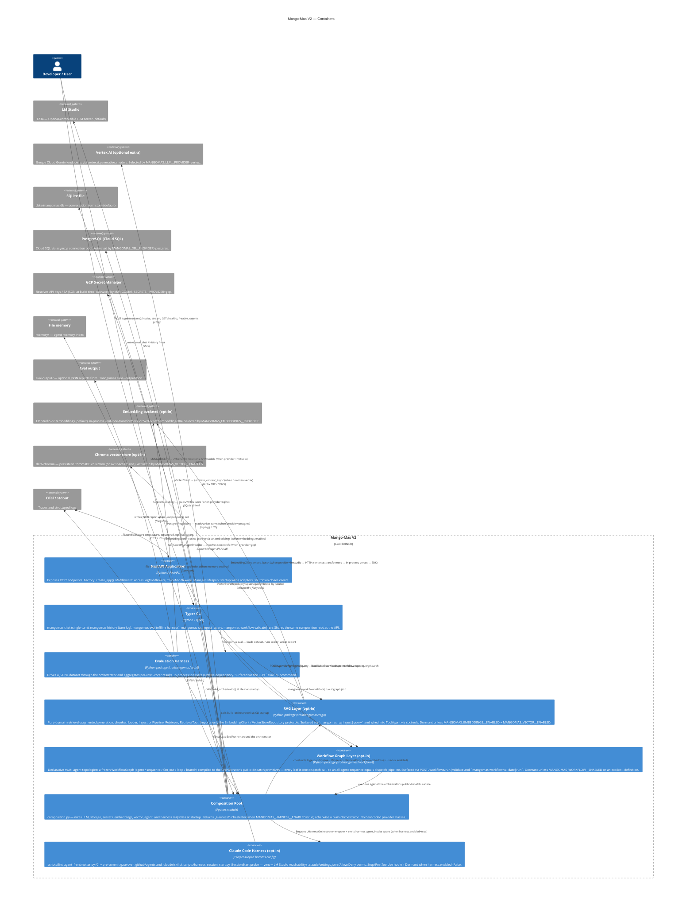

# C2 — Container Diagram

This diagram shows the major deployable / runnable units inside Mango-Mas V2
and how they communicate.

## Notes

- `api`, `cli`, and `eval_harness` share the same `composition.py` wiring;
  no duplicated adapter construction.
- The `composition` container is a module, not a separate process. It is shown
  separately to emphasise that all provider-specific code is isolated there.
- The LLM provider is chosen at runtime through `MANGOMAS_LLM__PROVIDER`.
  Today's built-in choices are `lmstudio` (the default) and `vertex` (an
  optional extra). Adding a new provider is a registry registration in
  `composition.py` — no other container changes required.
- The storage provider is chosen via `MANGOMAS_DB__PROVIDER`: `sqlite`
  (default) or `postgres` (asyncpg pool, requires `mangomas[postgres]`).
- The secrets provider is chosen via `MANGOMAS_SECRETS__PROVIDER`: `env`
  (default) or `gcp` (GCP Secret Manager, E2E verified in v0.3.1).
- The evaluation harness ships its own Scorer registry
  (`mangomas.eval.scorer_registry`) parallel to the agent/LLM/storage
  registries. Built-in scorers: `exact_match`, `regex_match`, `contains`,
  `json_keys`, `llm_judge`, `embedding`.
  The `embedding` scorer prefers `ctx.embeddings` and falls back to an
  `embed`-capable LLM; it raises only when neither is available.
- The **RAG layer** is opt-in and dual-gated: `ctx.embeddings` is attached
  when `MANGOMAS_EMBEDDINGS__ENABLED=true` and `ctx.vector_store` when
  `MANGOMAS_VECTOR__ENABLED=true`. The `RetrievalTool` is wired into
  `ctx.tools` only when **both** are present, so `ToolAgent` auto-discovers
  it without any new plumbing. The embedding backend is provider-pluggable
  (`lmstudio` | `sentence_transformers` | `vertex`); the vector store is
  Chroma with `hnsw:space=cosine` (similarity `1 - distance/2`). Chroma and
  sentence-transformers SDKs are optional extras (`mangomas[rag]`,
  `mangomas[embeddings-local]`), lazy-imported so the modules stay importable
  without them. With both flags `false` (the default) there is no
  behaviour change and no heavy dependency is touched.
- The Claude Code harness container is opt-in: with
  `MANGOMAS_HARNESS__ENABLED=false` (the default), the
  `_HarnessOrchestrator` wrapper is never engaged and the box is
  effectively absent. Skills, sub-agents, and the frontmatter linter
  remain installed but inert at runtime — they're consumed by the
  Claude Code IDE/web client and CI, not the FastAPI process.
- `memory/`, `eval-output/`, and harness scratch state
  (`.claude/cache/`, `.claude/state/`, `.claude/logs/`,
  `.claude/settings.local.json`) are excluded from git and Docker
  (see `.gitignore` / `.dockerignore`).
