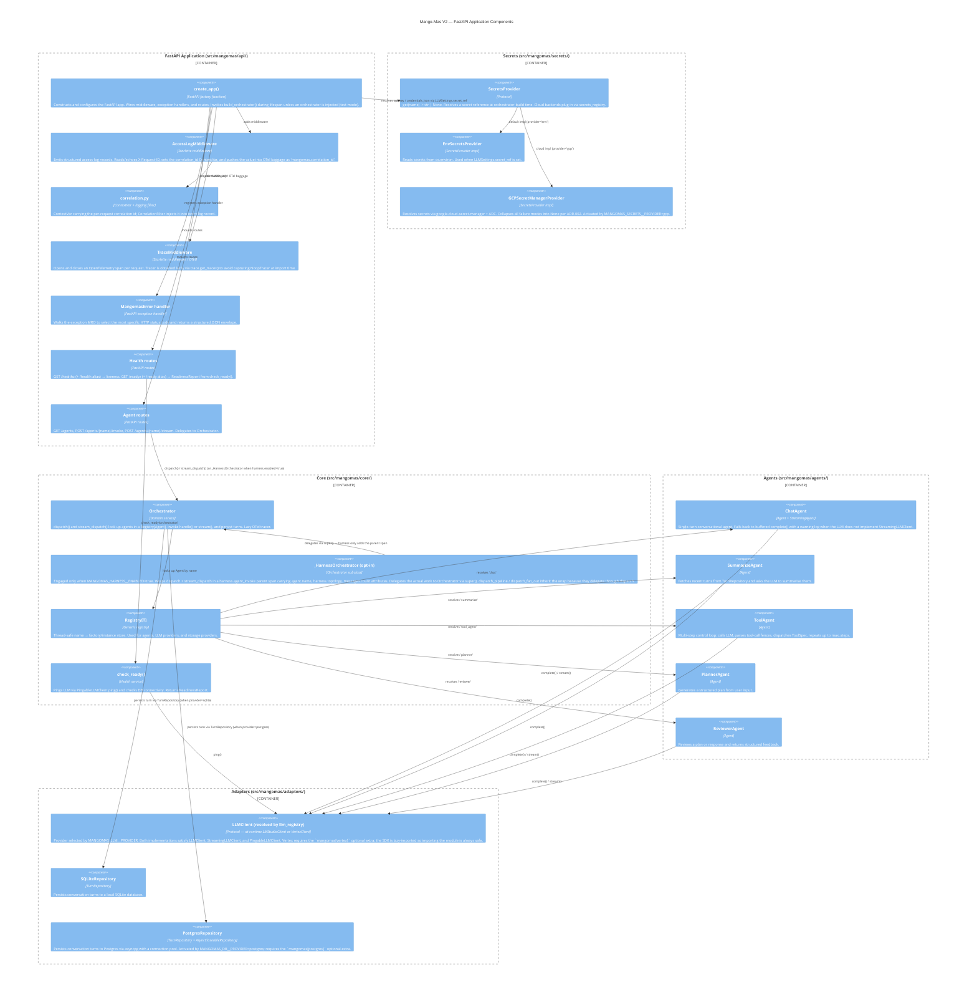

# C3 — Component Diagram (FastAPI Application)

This diagram shows the components inside the FastAPI Application container and
how they interact at the class / module level.

## Notes

- `Registry[T]` is the single extensibility point for agents and providers.
  Adding a new agent or LLM adapter does not require changes to `Orchestrator`,
  `create_app()`, or any existing component.
- The **LLM adapter** shown above is the one resolved at runtime by
  `llm_registry`: today either `LMStudioClient` (default, `MANGOMAS_LLM__PROVIDER=lmstudio`)
  or `VertexClient` (`MANGOMAS_LLM__PROVIDER=vertex`, requires the
  `mangomas[vertex]` optional extra). Vertex's SDK is lazy-imported inside
  `VertexClient.__init__`, so simply importing `mangomas.adapters.llm.vertex`
  never triggers a hard dependency.
- `TraceMiddleware` and `AccessLogMiddleware` are the two middleware components.
  `AccessLogMiddleware` owns the **correlation id** lifecycle: it reads/echoes
  `X-Request-ID`, sets the `correlation_id` ContextVar, and pushes the value into
  OTel baggage as `mangomas.correlation_id`. See
  [observability.md](observability.md) for the full request lifecycle.
- The **SecretsProvider seam** (`src/mangomas/secrets/`) is consulted at
  orchestrator-build time when `LLMSettings.secret_ref` is set. For LM Studio
  the resolved value becomes `api_key`; for Vertex it becomes the
  service-account JSON body (`credentials_json`). The GCP Secret Manager
  backend shipped in v0.3.1 and is E2E verified; additional cloud backends
  (e.g. Vault) plug in via `secrets_registry.register()` with no changes
  to agents or adapters.
- `check_ready()` is in `src/mangomas/api/health.py` and is called by the
  `/readyz` route handler. Both `LMStudioClient.ping()` and
  `VertexClient.ping()` are translated by `check_ready()` into a uniform
  `ReadinessReport`.
- The **evaluation harness** is not shown here because it does not run inside
  the FastAPI Application container — it is a CLI consumer of the same
  composition root and uses the same `Orchestrator`. See
  [docs/eval/harness.md](../eval/harness.md) for its component layout.
- The **Claude Code harness** (`_HarnessOrchestrator`, the frontmatter
  linter, the SessionStart hook) is opt-in via
  `MANGOMAS_HARNESS__ENABLED`. When disabled (the default),
  `build_orchestrator` returns a plain `Orchestrator` and the harness
  components above are not engaged. When enabled, the wrapper is
  transparent — every existing `dispatch` / `stream_dispatch` call works
  unchanged; the only observable difference is a `harness.agent_invoke`
  parent span and three extra debug-level log lines per invocation.
- All components that accept external input are configurable via
  `mangomas.config.Settings`; no hardcoded endpoints or model ids.
