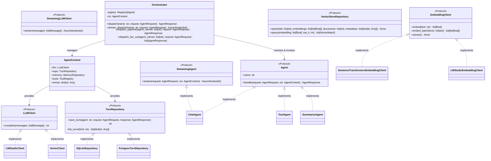
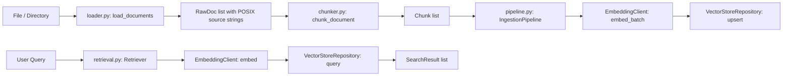
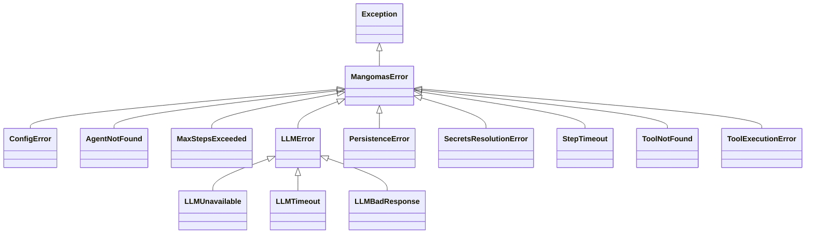

# C4 — Code Architecture (Core Domain & Implementation Contracts)

This document specifies the **Level 4 (Code)** architecture of the Mango-Mas V2 platform. It formalizes the concrete Python abstractions, runtime protocols, dependency inversion boundaries, and data contracts that realize the containers and components defined in [c1-context.md](c1-context.md), [c2-container.md](c2-container.md), and [c3-component.md](c3-component.md).

---

## 1. Architectural Style & Design Principles

Mango-Mas V2 follows **Hexagonal Architecture (Ports and Adapters)** with strict Layered Invariants:

1. **Stable Core Contracts**: `src/mangomas/core/` defines the stable agent/tool contracts plus the concrete `Orchestrator`, `AgentRequest`, `AgentResponse`, `Message`, and `AgentContext` types. The core avoids cloud SDKs and database drivers, but some core modules intentionally depend on shared libraries such as Pydantic and the OpenTelemetry API.
2. **Dependency Inversion**: Outer layers (CLI, FastAPI routes, persistence adapters, cloud SDKs) depend inwards on Core protocols. Components bind via `Registry[T]` and the composition root (`src/mangomas/composition/`).
3. **Protected Core Contracts (ADR-0021)**: Core contracts are locked under `[tool.mangomas.governance]`. Changes to protected files require explicit breaking-change commit trailers verified by `scripts/check_protected_paths.py`.
4. **Resilient Failure Encapsulation**: Cloud and external service exceptions (e.g. GCP Secret Manager, Vertex AI, LM Studio HTTP) are caught at the adapter perimeter and mapped to the typed `MangomasError` hierarchy.



---

## 2. Core Domain Abstractions (`src/mangomas/core/`)

### 2.1 The Agent Protocol & Context Model

- **`Agent`**: Minimal protocol requiring `name: str` and `async def handle(request: AgentRequest, ctx: AgentContext) -> AgentResponse`.
- **`StreamingAgent`**: Extended protocol requiring `async def stream(request: AgentRequest, ctx: AgentContext) -> AsyncIterator[str]`. If an agent does not implement `StreamingAgent`, the `Orchestrator` falls back to buffering `handle()` and yielding a single chunk.
- **`AgentContext`**: Runtime state carrier housing the injected `LLMClient`, `TurnRepository`, optional `MemoryRepository`, `ToolRegistry`, and extensibility `extras: dict[str, Any]` (e.g. cognitive sink hooks, tracing bags).
- **`AgentRequest` / `AgentResponse`**: Mutable Pydantic models. `AgentRequest` carries `messages`, `metadata`, and `max_steps`; `AgentResponse` carries `content`, `agent`, and `metadata`.

### 2.2 Orchestration & Topologies

- **`Orchestrator`**: Concrete dispatcher that stores registered agents internally and is typically wired by `Registry[T]`-backed composition code before requests are dispatched.
- **Iterative Control Loop**: Supports `AcceptanceFn` predicates to drive multi-turn refinement loops with bounded step limits (`max_steps`).
- **Pipeline & Fan-Out Topologies**:
  - `dispatch_pipeline(agent_names, request)`: Sequences execution across agent stages $A \to B \to C$, piping prior stage output to the next request.
  - `dispatch_fan_out(agent_names, request)`: Executes concurrent dispatches across multiple agents via `asyncio.gather` and collates results.
- **Harness Extension**: `_HarnessOrchestrator` wraps execution in OpenTelemetry parent spans when `MANGOMAS_HARNESS__ENABLED=true`, attributing span events with topology and message metadata without altering domain logic.

---

## 3. Adapters & Hexagonal Boundaries (`src/mangomas/adapters/`)

### 3.1 LLM Adapters (`adapters/llm/`)

- **`OpenAICompatHTTPClient`**: Shared base class for OpenAI-compatible REST endpoints (`LMStudioClient`). Handles `httpx` lifecycle, request execution, timeouts, connection pooling, and error translation.
- **`VertexClient`**: Native Google Cloud Vertex AI client using the `google-cloud-aiplatform` SDK. Implements lazy SDK importing (`# noqa: PLC0415`) so that the core package remains functional when the optional `[vertex]` extra is not installed.
- **Shared Translation**: `_http_errors.py` and `_vertex_errors.py` map raw network and API exceptions into domain-level `LLMError`, `LLMUnavailable`, `LLMTimeout`, and `LLMBadResponse`.

### 3.2 Embedding Adapters (`adapters/embeddings/`)

- **`SingleTextEmbedMixin`**: Implements `embed(text)` by delegating to `embed_batch([text])` and extracting the head vector.
- **`NoTransportAcloseMixin`**: Provides a no-op `aclose()` for embedded in-process models.
- **`SentenceTransformersEmbeddingClient`**: Local execution adapter backed by `sentence-transformers`.
  - Runs compute-bound inference in `asyncio.to_thread`.
  - Suppresses progress bar output (`show_progress_bar=False`) to prevent stdout corruption and pipe deadlocks in headless CLI/API runtimes.

### 3.3 Persistence & Vector Storage (`adapters/storage/`, `adapters/vector/`)

- **`SQLiteRepository`**: Embedded SQLite implementation for single-node local execution, supporting WAL mode and atomic turn insertion.
- **`PostgresTurnRepository`**: Enterprise multi-tenant relational persistence backed by `asyncpg`. Automatically isolates turn records by `tenant_id`.
- **`ChromaVectorStore`**: Embedded vector database adapter implementing `VectorStoreRepository` for dense document chunk retrieval.

---

## 4. Pure-Domain RAG Subsystem (`src/mangomas/rag/`)



- **Document Source IDs**: `rag/loader.py` stores each `RawDoc.source` as a canonical POSIX string (`Path.as_posix()` for a single file, or a POSIX relative path within a loaded directory).
- **Chunker**: Pure word-window chunking algorithm splitting text by token boundaries with configurable overlap.
- **`IngestionPipeline`**: End-to-end ingestion service that orchestrates loading, chunking, batch embedding generation, and vector store upsertion.
- **`Retriever` & `RetrievalTool`**: Encapsulates semantic vector search into an invocable `ToolSpec`, allowing `ToolAgent` to query ingested corporate knowledge within standard agent control loops.

---

## 5. Declarative Workflow Graph (`src/mangomas/workflow/`)

The workflow engine executes a bounded workflow tree defined as inline JSON or a JSON file. The graph shape stays tree-structured, while `LoopNode` adds bounded re-dispatch at runtime rather than a structural cycle in the JSON:

- **`WorkflowGraph`**: Frozen Pydantic model with a single `root` node.
- **`WorkflowNode` Hierarchy**:
  - `AgentNode`: Invokes a registered domain agent.
  - `SequenceNode`: Chains nodes in serial execution.
  - `FanOutNode`: Dispatches parallel branch evaluation.
  - `LoopNode`: Iterates execution until an `AcceptanceFn` returns true or step limits are reached.
  - `BranchNode`: Evaluates conditional branching based on compiled `PredicateSpec` rules.
- **Predicate Compilation (`predicate.py`)**: Compiles JSON predicate expressions (`contains` and `regex`) into synchronous acceptance predicates executed over node responses.

---

## 6. Cognitive Plane & Governance (`src/mangomas/cognitive/`, `src/mangomas/harness/`)

### 6.1 CognitiveSignal Contracts

- Interoperates with `mango-integration-contracts` to emit machine-readable telemetry on agent performance, risk, and PII detection.
- **Non-Interference Invariants**: Enforces strict policy decoupling; cognitive signals are observational artifacts and cannot alter deterministic policy input shapes or authorization paths.

### 6.2 Governance & Protected Core Paths

`scripts/check_protected_paths.py` enforces commit-level governance:

```toml
[tool.mangomas.governance]
protected_paths = [
    "src/mangomas/core/agent.py",
    "src/mangomas/core/orchestrator.py",
    "src/mangomas/core/structured.py",
    "src/mangomas/core/tools.py",
    "src/mangomas/errors.py",
    "src/mangomas/registry.py",
]
breaking_change_marker_aliases = ["BREAKING-CHANGE", "# approved-breaking-change"]
```

---

## 7. Error Taxonomy & Resilience Mechanics

All system exceptions derive from `MangomasError`:



- **HTTP Status Mapping**: The FastAPI exception handler walks the exception MRO to yield canonical HTTP status codes (`ConfigError` $\to$ 400, `AgentNotFound` $\to$ 404, `MaxStepsExceeded` $\to$ 422, `LLMUnavailable` $\to$ 503, `LLMTimeout` $\to$ 504).
- **Correlation Propagation**: Every error envelope carries `error`, `message`, `correlation_id`, and ISO-8601 `timestamp`.
