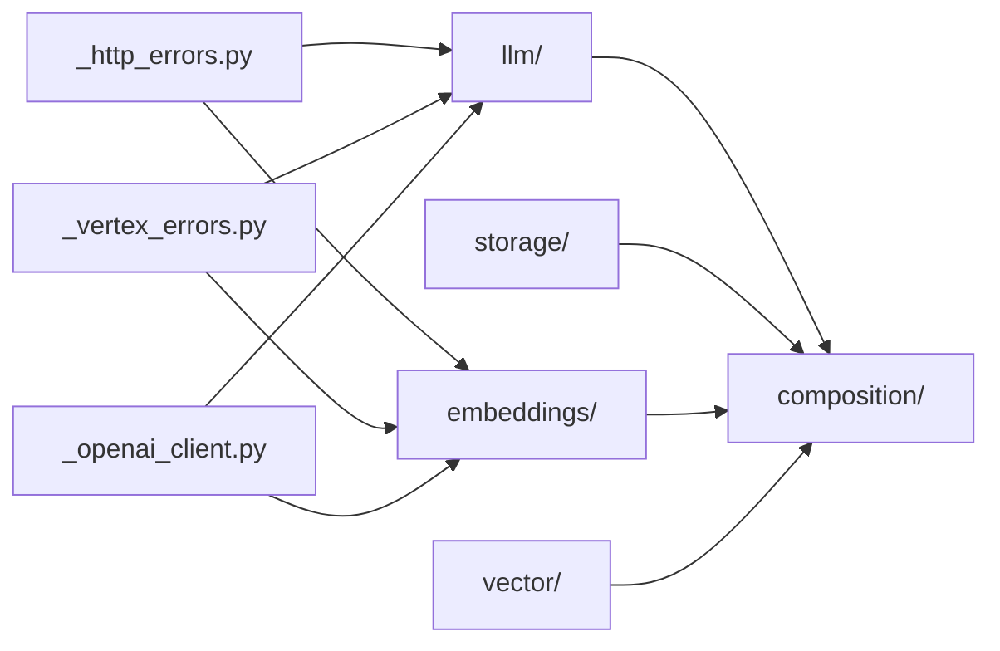

# Adapters — `src/mangomas/adapters/`

## Scope

Every outbound integration: LLM providers, turn and memory storage, embedding
backends and the vector store. Each seam declares its `@runtime_checkable`
Protocols in its own base module (`llm/base.py`, `storage/base.py`,
`embeddings/base.py`, `vector/base.py`); the concrete classes beside them are
selected and built by `composition/`, never imported across a layer boundary.

No file here is a protected path.

## Map



## Owners

| Surface | Agent | Skill |
|---|---|---|
| `llm/` and typed-error translation | `mango-llm-adapter-dev` | `mango-adapter` |
| `storage/` | `mango-storage-adapter-dev` | `mango-adapter` |
| `embeddings/`, `vector/` | `mango-rag-dev` | `mango-rag` |
| Protocol back-compat audits (read-only) | `mango-protocol-auditor` | — |
| Work spanning several seams | `mango-backend` | `mango-adapter` |

## Invariants

Protocols declared per seam, AST-verified against each seam's base module by
`tests/tooling/test_directory_claude_md.py`. Every name below really carries
the `@runtime_checkable` decorator; a row naming a class that does not fails
the build.

| Seam | Package | `@runtime_checkable` Protocols |
|---|---|---|
| LLM completion | `llm` | `LLMClient`, `StreamingLLMClient`, `PingableLLMClient` |
| Persistence | `storage` | `TurnRepository`, `MemoryRepository`, `AsyncCloseableRepository`, `FailureRecordingRepository` |
| Embeddings | `embeddings` | `EmbeddingClient` |
| Vector search | `vector` | `VectorStoreRepository` |

- **Lazy SDK imports.** `google-cloud-*`, `chromadb` and `sentence-transformers`
  are imported inside the method that needs them, so importing any module here
  is safe without the optional extra installed. This is a contract, not a
  style: composition imports every factory module unconditionally.
- **Typed errors at the boundary.** httpx failures are translated through the
  shared `_http_errors.py` into the `LLMError` family; Vertex failures go
  through `_vertex_errors.py`. A raw `httpx` exception must never escape.
- Capability protocols are *additive*: a client may satisfy `LLMClient` alone.
  Callers narrow with `isinstance`, which is why the decorator matters.
- `_openai_client.py` holds the shared httpx lifecycle so the LM Studio LLM and
  embedding clients cannot drift apart.

## Boundaries

- Do not import a concrete adapter outside `composition/`. Other layers see the
  Protocol.
- Do not import an optional SDK at module scope — it turns a missing extra into
  an import-time crash for everyone.
- Do not let `rag/` types leak in here. The vector seam speaks in primitives so
  the dependency points one way only.
- Adding a method to an existing Protocol breaks every implementer: add a new
  capability Protocol instead.
- The independence rules between the opt-in packages are mechanised; run
  `make lint-imports` rather than reasoning about them.

## Verify

```bash
python -m pytest tests/adapters -q
make lint-imports
make typecheck
```
