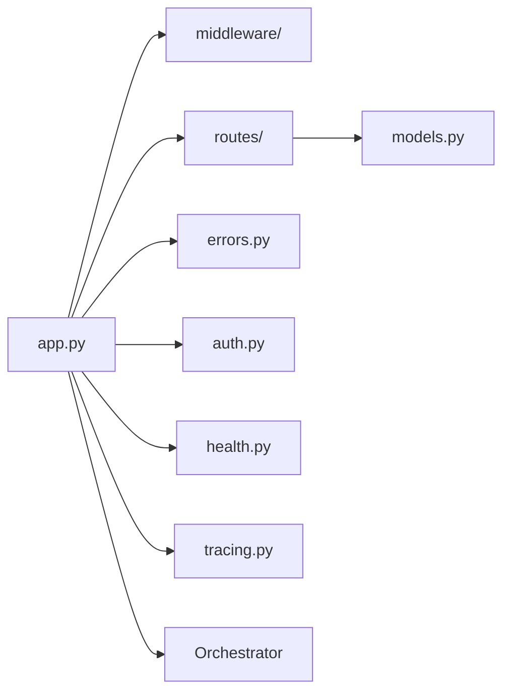

# API — `src/mangomas/api/`

## Scope

The HTTP surface: the `create_app` factory, middleware installation, the error
envelope, auth, health and the routers under `routes/`. It depends on
`composition/` for wiring and on `core/` for contracts; it never constructs an
adapter itself.

No file here is a protected path — including `errors.py`, which holds the
status table. `src/mangomas/errors.py` is the protected one, and it is a
different directory.

## Map



## Owners

| Surface | Agent | Skill |
|---|---|---|
| `create_app`, middleware order, `auth.py`, `health.py`, `tracing.py` | `mango-api-impl-dev` | `mango-observability` |
| Endpoint or integration questions spanning the layer | `mango-api-dev` | — |
| Streaming frames in `routes/agents.py` | `mango-sse-streamer` | — |
| Request/response DTO evolution | `mango-schema-evolution` | — |
| The status table in `errors.py` | `mango-error-taxonomy-dev` | `mango-error` |

## Invariants

Middleware **install** order, read from `app.py` by AST and asserted by
`tests/tooling/test_directory_claude_md.py`. Starlette wraps in **reverse**, so
the last installed is the outermost layer — which is why this order is
load-bearing rather than cosmetic.

| # | Middleware | Why here |
|---|---|---|
| 1 | `ConcurrencyLimitMiddleware` | Opt-in. Installed first, so it is innermost |
| 2 | `MaxBodySizeMiddleware` | Opt-in. Also inner of log/trace |
| 3 | `AccessLogMiddleware` | Outer of backpressure, so a rejection is still logged |
| 4 | `TraceMiddleware` | Opens the per-request span around everything inner |
| 5 | `CORSMiddleware` | Installed only when origins are non-empty |
| 6 | `TenancyMiddleware` | Opt-in, and installed **last** via `_install_tenancy`, so it is outermost: the tenant `ContextVar` is set before logging, tracing or any route sees the request |

- 1, 2 and 6 are installed inside helpers (`_install_backpressure`,
  `_install_tenancy`), so their **definition** order in the file is not their
  install order — `_install_tenancy` is defined near the top and called last.
  The test resolves helper calls rather than sorting by line.
- Backpressure inner of log/trace is the point: a 413 or 503 that nothing
  recorded is an outage you cannot see.
- Health routes are never authenticated.
- The error handler walks the exception MRO and picks the most specific status,
  so a new subclass inherits a sane mapping instead of falling to 500.
- Route handlers raise typed errors; they never build a status code by hand.

## Boundaries

- Do not import a concrete adapter here. Ask `composition/` for it.
- Do not reorder `add_middleware` calls without updating the table above — the
  test compares them and will name the mismatch.
- Do not restate the streaming frame format; it belongs to `routes/agents.py`.
- Do not add a status code inline. `errors.py` owns the mapping, and
  `tests/test_errors.py` walks it.
- An added request or response field must be default-safe: `AgentRequest` and
  `AgentResponse` are a public wire contract with a snapshot test.

## Verify

```bash
python -m pytest tests/test_api.py -q
python -m pytest tests/test_errors.py -q
make typecheck
```
