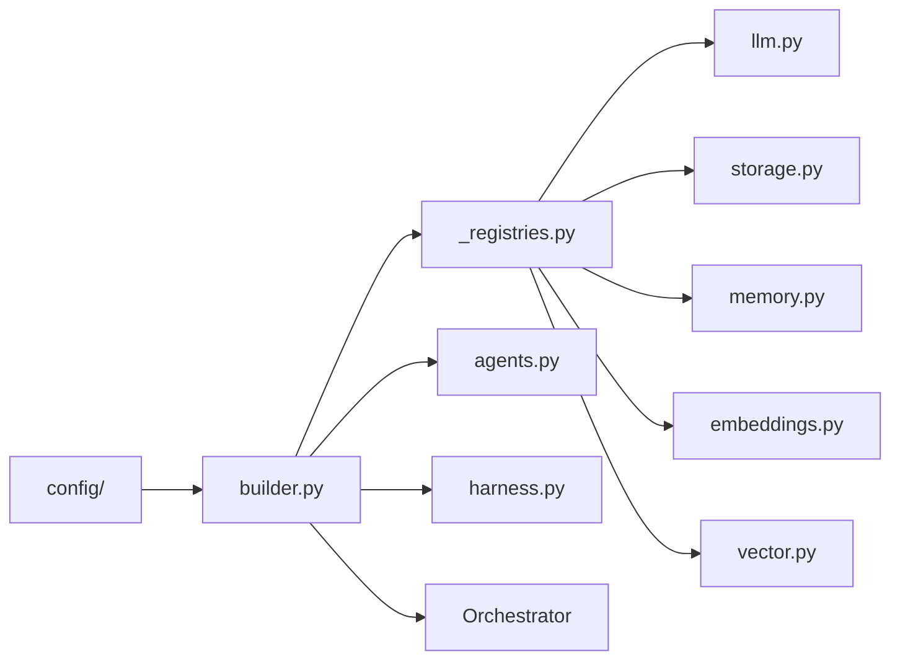

# Composition — `src/mangomas/composition/`

## Scope

The single wiring point: settings in, a ready `Orchestrator` out. Every
concrete adapter is chosen and constructed here and nowhere else, which is what
keeps `core/` free of imports pointing outward. One factory module per seam;
`builder.py` is the only thing that assembles them.

Nothing here is a protected path. For the design rules this directory exists to
satisfy, see § Key Design Rules in the root `AGENTS.md`.

## Map



## Owners

| Surface | Agent | Skill |
|---|---|---|
| Wiring across several seams at once | `mango-backend` | `mango-composition-builder` |
| `llm.py` and the LLM factories | `mango-llm-adapter-dev` | `mango-adapter` |
| `storage.py`, `memory.py` | `mango-storage-adapter-dev` | `mango-adapter` |
| `embeddings.py`, `vector.py`, `rag.py` | `mango-rag-dev` | `mango-rag` |
| `secrets.py` | `mango-secrets-dev` | `mango-adapter` |
| `harness.py` span routing | `mango-telemetry-exporter-dev` | `mango-observability` |

## Invariants

Registrations, verified against the live registries by
`tests/tooling/test_directory_claude_md.py` — a name here that is not really
registered fails the build.

| Seam | Registry | Provider names |
|---|---|---|
| LLM client | `llm` | `lmstudio`, `vertex` |
| Turn storage | `storage` | `sqlite`, `postgres` |
| File memory | `memory` | `file` |
| Embeddings | `embeddings` | `lmstudio`, `sentence_transformers`, `vertex` |
| Vector store | `vector` | `chroma` |

- `agent` is deliberately absent from that table: its names come from discovered
  agent classes in `agents.py`, not a fixed list.
- Registration happens at import of `mangomas.composition`. A factory that
  registers on first *call* is a latent `UnknownProvider`.
- Heavy SDKs (`google-cloud-*`, `chromadb`, `sentence-transformers`) are
  imported **inside** their factory, never at module scope, so importing this
  package is safe without the optional extras installed.
- Opt-in seams stay off: `embeddings.py`, `vector.py`, `rag.py` and `signal.py`
  construct nothing unless their `enabled` flag is set.

## Boundaries

- Do not resolve a provider anywhere else. A registry lookup outside this
  package is a service locator, and the whole point of the directory is that
  there is exactly one.
- Do not import a concrete adapter class into `core/`, `agents/` or `api/` —
  those layers see protocols only.
- Do not add a tunable as a literal here. It belongs in `config/`, and
  `tests/deploy/test_env_example_contract.py` will reject a field the root
  instruction pair does not document.
- Changing a factory signature changes a public seam: check the layering
  contract with `make lint-imports` before assuming it is internal.

## Verify

```bash
python -m pytest tests/composition -q
make lint-imports
make typecheck
```
